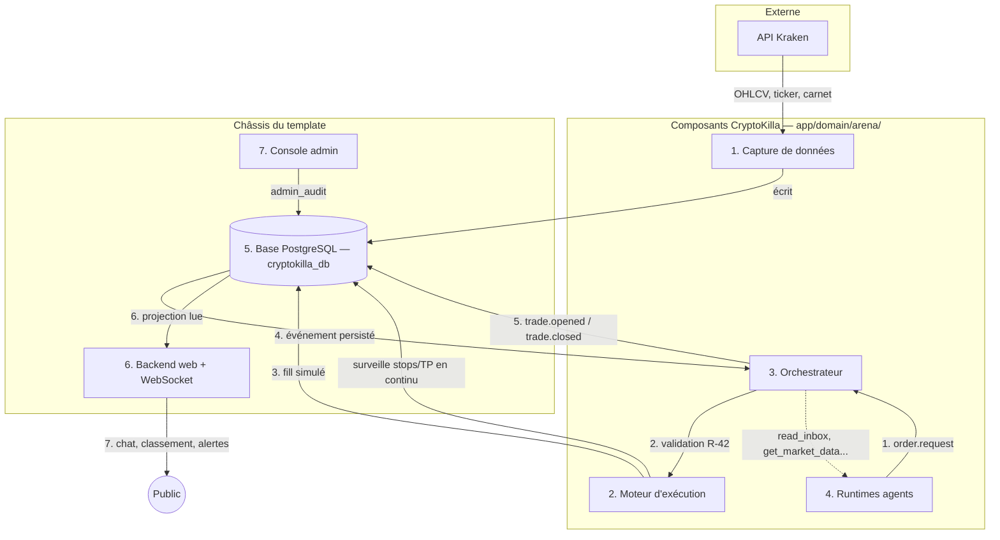

# CHAPITRE 11 — Vue d'ensemble du système

> Registre : architecture normative. Dépendances : l'intégralité du Lot 1
> (Annexe B, Annexe C, chapitres 12, 16).
>
> Amendements intégrés — **AMEND-03**, **AMEND-04**, **AMEND-11** (voir
> [`cryptokilla-amendements-template.md`](../cryptokilla-amendements-template.md)) :
> la base de données est le conteneur PostgreSQL natif du template
> (`cryptokilla_db`), pas SQLite ; tout le code de l'arène vit dans des
> fichiers nouveaux sous `app/domain/arena/` ; le cœur du jeu n'utilise pas
> `MODULE_AGENTIC`. Ces trois amendements ne sont pas des ajouts tardifs :
> ce chapitre est rédigé directement avec eux.
>
> **[OUVERT : Q-19, BLOQUANTE pour la couche C1]** — la topologie de
> déploiement des processus long-running (services docker additionnels ou
> infrastructure séparée) n'est pas tranchée. Ce chapitre décrit la
> responsabilité logique de chaque composant et l'emplacement de son code
> (AMEND-04) — jamais sa topologie de déploiement exacte. Ne pas commencer
> les workers avant la réponse à Q-19 (ARENA.md §6).

## Rôle du chapitre

La carte du système : composants, frontières, flux, principes
d'architecture. C'est le premier chapitre technique que lira un agent
développeur.

## 11.1 — Les composants (liste exhaustive)

**[NORME N-C11-01]** Le système compte exactement **sept composants**,
aucun de plus :

| # | Composant | Responsabilité | Code (AMEND-04) | Chapitre |
|---|---|---|---|---|
| 1 | Capture de données | Ingère Kraken (OHLCV, ticker, carnet) en continu, écrit en base. | `app/domain/arena/capture/` | 14 |
| 2 | Moteur d'exécution | Interface unique d'exécution ; deux implémentations (`SimulatedExecutor` v1 / `KrakenExecutor` futur) ; détient seul les stops/TP actifs. | `app/domain/arena/engine/` | 13 |
| 3 | Orchestrateur | Garde-fou, comptable, arbitre, horloger. | `app/domain/arena/orchestrator/` (sous-paquets `economy/`, `memoryx/`, `events/` pour les responsabilités transverses tokens/pool, mémoire, event-store) | 12 |
| 4 | Runtimes agents | Un processus par agent trader (chapitre 16) + Killa + spectateurs (Partie V). | `app/domain/arena/agents/` | 16, 22, 23 |
| 5 | Base de données | Source de vérité unique ; PostgreSQL natif du template (AMEND-03). | conteneur `cryptokilla_db` (châssis, intouchable en tant que conteneur — AGENTS.md §« Ne touchez jamais ») | 15 |
| 6 | Backend web + WebSocket | Sert la plateforme publique. | châssis (`app/core/`) étendu par les routeurs domaine (`app/domain/routers.py`) | Partie VI |
| 7 | Console admin | Fonctions d'administration de l'arène. | routeur et pages domaine, adossés aux rôles utilisateurs du template (AMEND-05, détaillé au chapitre 31) | 31 |

Les sous-paquets `economy/`, `memoryx/`, `events/` cités pour le composant
3 ne sont pas des composants supplémentaires : ce sont des divisions
internes du code de l'orchestrateur, correspondant respectivement à
l'économie des tokens (chapitre 6), la mémoire des agents (chapitre 19) et
le journal d'événements (Annexe B, 11.2 ci-dessous).

## 11.2 — Principes d'architecture (verrouillés)

**[NORME N-C11-02]** **Event-sourcing léger** — tout objet de l'Annexe B
est persisté à l'émission dans la table `events`, append-only (chapitre
15) : c'est la source de vérité. L'état courant (soldes, positions,
classement) est une **projection reconstructible** depuis cette table.
C'est ce qui rend la séquence horaire idempotente (exigence du chapitre 12,
N-C12-11) et l'historique public incontestable (chapitre 29) : recalculer
l'état revient à rejouer les événements, jamais à faire confiance à une
valeur stockée isolément.

**[NORME N-C11-03]** Les composants ne communiquent **que** par la base
d'événements — jamais d'appel direct agent→agent ou agent→moteur. Le
mécanisme de transport exact des notifications en temps réel (`LISTEN`/
`NOTIFY` PostgreSQL, sondage périodique, ou file dédiée) est un détail
d'implémentation laissé au chapitre 26 ; ce chapitre ne fixe que le
principe : aucun appel direct, tout transite par les événements persistés.

**[NORME N-C11-04]** Les clés et secrets (API LLM, Kraken) vivent
uniquement côté orchestrateur, moteur d'exécution et infrastructure —
jamais dans les runtimes agents (R-05, chapitre 28), et jamais en base
(chapitre 15) ni en `.env` édité à la main pour sa structure (AGENTS.md).

**[NORME N-C11-05]** Tout est configuration (R-100) : chaque composant lit
le registre des paramètres (chapitre 32, `season_params`) au démarrage et
sur signal de rechargement — aucune valeur de jeu n'est en dur dans le
code.

## 11.3 — Stack de référence (v1)

**[NORME N-C11-06]** La stack v1 est fixée comme suit :

- **Langage** : Python, pour l'ensemble du code domaine (`app/domain/arena/`).
- **Base de données** : PostgreSQL natif — le conteneur `cryptokilla_db`
  du template (AMEND-03, remplace la proposition initiale « SQLite v1
  portable PostgreSQL » ; l'event-sourcing et les ledgers sont inchangés
  sur le principe, renforcés par la vraie concurrence d'écriture
  multi-processus qu'offre PostgreSQL — c'était la limite documentée de
  SQLite).
- **Web** : FastAPI + WebSocket du châssis, étendus par les routeurs
  domaine (`app/domain/routers.py`, point de montage prévu par le
  template).
- **Aucun framework d'agents tiers** : ni pour les runtimes traders, ni
  pour l'orchestrateur, ni pour la surveillance des stops — implémentation
  maison explicite (AMEND-11). Motivation détaillée au chapitre 19 : tout
  doit rester auditable et documenté dans le livre, sans dépendre d'une
  abstraction externe. `MODULE_AGENTIC` du châssis reste une option
  ouverte (Q-20) pour Killa, les spectateurs et l'appel de notation du
  pool (chapitre 12.4) uniquement — jamais pour le cœur du jeu.

## Schéma d'architecture

## Checklist de conformité

- [x] Sept composants exactement, avec table responsabilités × code × chapitre.
- [x] Event-sourcing et idempotence liés explicitement (N-C11-02).
- [x] Schéma mermaid des flux numérotés.
- [x] AMEND-03/AMEND-04/AMEND-11 intégrés sans être présentés comme des ajouts tardifs.
- [x] Q-19 signalée comme bloquante pour C1 ; aucune topologie de déploiement tranchée.
- [x] Aucun composant ajouté ; aucune communication directe inter-agents ; aucune autre technologie introduite.
