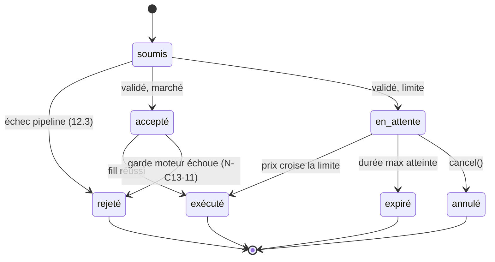

# CHAPITRE 13 — Le moteur d'exécution et la simulation

> Registre : normatif technique. Dépendances : R-43, R-45, [chapitre 7](10-chapitre-07-trading.md),
> [chapitre 12](15-chapitre-12-orchestrateur.md) (pipeline de validation — cité,
> non dupliqué), Annexe F (formules exactes — à venir, Lot 5 ; ce chapitre
> fixe les **formes et comportements**, pas la rigueur formelle finale).
>
> Scénario fil rouge : les deux exemples chiffrés de ce chapitre sont des
> illustrations **indépendantes** du fil rouge `claude-nord-3`/`ord-3e17`
> des Annexes B et C — mêmes principes, valeurs différentes, pour ne pas
> laisser croire à une identité exacte entre ce chapitre et ces annexes.
> Marquées explicitement « illustratif ».
>
> Code : `app/domain/arena/engine/` (AMEND-04).

## Rôle du chapitre

Spécifier le comportement du moteur : interface, cycle de vie d'un ordre,
modèle de fill simulé, déclenchement des stops/TP, rôle en backtest, et la
bascule future vers le réel.

## 13.1 — Interface unique

**[NORME N-C13-01]** Le moteur expose exactement **six méthodes** :

```
place(order)                          → accepte ou rejette, retourne l'issue
modify(position_id, stop?, tp?)       → met à jour stop/take profit
close(position_id)                    → clôture au marché
cancel(order_id)                      → annule un ordre limite en attente
get_positions(agent_id)               → positions ouvertes de l'agent
get_fills(agent_id)                   → historique des exécutions de l'agent
```

`SimulatedExecutor` (v1) et `KrakenExecutor` (futur, hors périmètre)
implémentent cette interface **à l'identique** : aucun composant amont
(orchestrateur, agents) ne sait laquelle des deux implémentations tourne.

**[NORME N-C13-02]** Le moteur détient et surveille **seul** les stops et
take profits (R-43) : surveillance sur chaque bougie 1 min minimum,
indépendante de la cognition — elle fonctionne pendant les veilles, les
pauses de saison, et même un crash de l'orchestrateur (chapitre 12, cas
dégradés).

## 13.2 — Modèle de fill simulé (comportement)

Formes verrouillées ; formules exactes, notation rigoureuse et exemples
canoniques en Annexe F.

**[NORME N-C13-03]** Prix de référence `ref` = milieu du carnet capturé au
moment de l'évaluation du fill ; à défaut de carnet disponible, dernier
prix connu. `half_spread = (ask − bid) / (2 × ref)`.

**[NORME N-C13-04]** Ordre marché : `fill = ref × (1 ± (half_spread +
slippage))` (`+` à l'achat, `−` à la vente). Le `slippage` croît avec la
taille de l'ordre rapportée à la liquidité horaire de la paire, sous forme
racine carrée : `slippage = min(k_slippage × √(taille / volume_1h),
slippage_max)` — coefficient `[PARAM: k_slippage]`, plafond `[PARAM:
slippage_max]`.

**[NORME N-C13-05]** Garde de liquidité : si `taille > [PARAM:
part_max_liquidite] × volume_1h`, l'ordre est rejeté avec `E-LIQUIDITY` —
aucun fill partiel (chapitre 7.4).

**[NORME N-C13-06]** Frais `[PARAM: frais_par_ordre]` appliqués à
**chaque** exécution — ouverture ET clôture — sur le notionnel exécuté.

**[NORME N-C13-07]** Dissymétrie stop/take profit, verrouillée : un stop
touché est exécuté comme un ordre marché **au niveau du stop, avec
slippage défavorable** (un stop ne garantit pas son prix — réalisme
assumé). Un take profit touché est exécuté **au niveau du TP, sans
slippage défavorable supplémentaire**. Cette asymétrie reflète une
mécanique de marché réelle (une sortie forcée en catastrophe coûte plus
qu'une sortie planifiée) et n'est **pas** un biais artificiel contre
l'agent — elle s'applique identiquement à toutes les dynasties.

**[NORME N-C13-08]** Ordre limite : exécuté quand le prix de référence
croise le prix limite ; expiration à `[PARAM: duree_max_ordre_limite]`
(`E-EXPIRED`, notifié via `order.rejected`).

**[NORME N-C13-09]** Latence simulée `[PARAM: latence_simulee]` : le fill
est évalué à `t_acceptation + latence_simulee`, sur les données de cet
instant — pas sur les données au moment de la soumission.

**[NORME N-C13-10]** Règle de la mèche : un stop ou un take profit est
réputé franchi dès qu'une bougie 1 min touche son niveau, même en mèche
(haut ou bas de bougie), pas seulement en clôture.

### La double garde d'`E-LIQUIDITY` (précision annoncée au chapitre 12, N-C12-16)

**[NORME N-C13-11]** L'orchestrateur vérifie la liquidité à la
**validation** (avant transmission au moteur, chapitre 12.3). Le moteur la
revérifie **au moment du fill** (garde ci-dessus, N-C13-05) : les
conditions de liquidité peuvent avoir changé entre l'acceptation de
l'ordre et l'évaluation effective du fill — notamment à cause de la
latence simulée (N-C13-09) ou pour un ordre limite resté longtemps en
attente. Si la garde moteur échoue **après** que l'orchestrateur a déjà
accepté l'ordre, le moteur émet un `order.rejected` **tardif** portant le
code `E-LIQUIDITY`, avec un `detail` précisant qu'il s'agit d'un rejet au
fill et non à la validation. L'ordre transite alors par l'état `rejeté`
depuis `accepté` (voir machine à états ci-dessous), et non depuis `soumis`.

## 13.3 — Trois usages, un moteur

**[NORME N-C13-12]** Le même moteur sert trois usages :

- **Live simulé** — données de marché réelles en temps réel, fills
  simulés selon les formes ci-dessus.
- **Backtest** — mêmes formules, appliquées à des données historiques ;
  `run_backtest` (Annexe C) appelle **ce** moteur, jamais une
  implémentation parallèle — c'est ce qui rend les backtests des agents
  représentatifs de ce qu'ils vivraient en trading réel.
- **Replay** — rejeu pas à pas d'une période archivée, pour l'observabilité
  et le débogage (chapitre 33).

## 13.4 — Vers le réel (hors périmètre v1)

Conditions de bascule envisagées, non exhaustives : une saison simulée
complète menée à son terme, un audit de sécurité (chapitre 28), un
capital réel minime engagé par l'exploitant (jamais par le public,
chapitre 30). **[NORME N-C13-13]** L'invariant de conception : la bascule
vers `KrakenExecutor` consiste à changer l'implémentation injectée dans
l'interface à six méthodes — **zéro changement** côté agents ou
orchestrateur, qui ne connaissent que l'interface.

## Cycle de vie d'un ordre — machine à états

**[NORME N-C13-14]** Un ordre est à tout instant dans un des sept états
suivants :

| État | Signification |
|---|---|
| `soumis` | Reçu par l'orchestrateur, pas encore validé. |
| `accepté` | A passé le pipeline de validation (chapitre 12.3), transmis au moteur. |
| `en_attente` | Ordre limite accepté, prix limite pas encore croisé. |
| `exécuté` | Fill réalisé, `trade.opened`/`trade.closed` publié. |
| `rejeté` | Rejeté à la validation OU au fill (garde tardive, N-C13-11). |
| `expiré` | Ordre limite arrivé à `[PARAM: duree_max_ordre_limite]` sans exécution. |
| `annulé` | Retiré via `cancel(order_id)` avant exécution. |

### Table des transitions

| État courant | Événement | État suivant |
|---|---|---|
| `soumis` | échec pipeline (chapitre 12.3) | `rejeté` |
| `soumis` | validation réussie, ordre marché | `accepté` → immédiatement évalué |
| `soumis` | validation réussie, ordre limite | `accepté` → `en_attente` |
| `accepté` | fill évalué avec succès | `exécuté` |
| `accepté` | garde moteur échoue au fill (N-C13-11) | `rejeté` |
| `en_attente` | prix de référence croise la limite | `exécuté` |
| `en_attente` | `[PARAM: duree_max_ordre_limite]` atteint | `expiré` |
| `en_attente` | `cancel(order_id)` reçu | `annulé` |



## Deux exemples chiffrés (illustratifs, non normatifs)

### Exemple 1 — Ordre marché avec slippage (achat)

Données : `ref = 42000,00` EUR ; carnet `bid = 41991,60` / `ask =
42008,40` → `half_spread = (42008,40 − 41991,60) / (2 × 42000,00) =
0,02 %` ; taille de l'ordre `3000,00` EUR ; volume horaire de la paire
`3 000 000,00` EUR ; `[PARAM: k_slippage] = 0,002` (illustratif).

`slippage = 0,002 × √(3000 / 3 000 000) = 0,002 × √0,001 ≈ 0,002 ×
0,031623 ≈ 0,0000632` (≈ 0,00632 %, bien sous un `slippage_max`
illustratif de 0,2 % — pas de plafonnement).

`fill = 42000,00 × (1 + 0,0002 + 0,0000632) = 42000,00 × 1,0002632 ≈
42011,06` EUR.

Garde de liquidité : `[PARAM: part_max_liquidite] = 5 %` (illustratif) ×
3 000 000 = 150 000 EUR ≫ 3000 EUR → pas de rejet.

Frais (`[PARAM: frais_par_ordre] = 0,25 %`) : `0,0025 × 3000,00 = 7,50`
EUR.

### Exemple 2 — Stop touché en mèche, avec slippage défavorable

Une position longue a son stop à `40000,00` EUR. Une bougie 1 min touche
ce niveau en mèche (règle de la mèche, N-C13-10). À cet instant : carnet
`bid = 39988,00` / `ask = 40012,00` → `half_spread = (40012,00 −
39988,00) / (2 × 40000,00) = 0,03 %` ; taille de la position `1500,00`
EUR ; volume horaire à ce moment, plus mince, `1 000 000,00` EUR ;
`[PARAM: k_slippage] = 0,002` (même paramètre, saison-wide).

`slippage = 0,002 × √(1500 / 1 000 000) = 0,002 × √0,0015 ≈ 0,002 ×
0,038730 ≈ 0,0000775` (≈ 0,00775 %).

`fill = 40000,00 × (1 − 0,0003 − 0,0000775) = 40000,00 × 0,9996225 ≈
39984,90` EUR (**sous** le niveau du stop — dissymétrie N-C13-07 : le
stop ne garantit pas son prix).

Garde de liquidité : `5 % × 1 000 000 = 50 000` EUR ≫ 1500 EUR → pas de
rejet.

Frais de clôture : `0,0025 × 1500,00 = 3,75` EUR.

## Ce que le simulateur ne modélise PAS en v1

Encadré d'honnêteté, pour éviter toute surinterprétation des performances
simulées :

- **Pas d'impact de marché persistant** — un fill simulé ne modifie pas le
  carnet pour les évaluations suivantes ; en réalité, un gros ordre laisse
  une trace durable sur le prix.
- **Pas de file d'attente du carnet** — le modèle ne simule pas la
  position d'un ordre limite dans la file au même niveau de prix que
  d'autres participants.
- **Pas de fills partiels** — un ordre passe en totalité ou est rejeté
  (chapitre 7.4) ; un exchange réel peut remplir partiellement un gros
  ordre à plusieurs prix.

Ces simplifications sont assumées pour la v1 : le simulateur mesure la
décision et la discipline de risque des agents, pas la microstructure fine
du marché.

## Checklist de conformité

- [x] Interface en 6 méthodes exactement.
- [x] Dissymétrie stop/TP documentée (N-C13-07).
- [x] Machine à états de l'ordre en 7 états, avec table de transitions et diagramme.
- [x] Deux exemples chiffrés complets, arithmétique vérifiée (marché + stop en mèche).
- [x] Encadré des non-modélisations (impact de marché, file d'attente, fills partiels).
- [x] Lien backtest = même moteur (N-C13-12).
- [x] Double garde d'`E-LIQUIDITY` précisée, comme promis au chapitre 12 (N-C13-11).
- [x] Aucune formule finale d'Annexe F anticipée au-delà des formes déjà verrouillées par le brief ; aucun fill partiel ; aucune promesse de représentativité du réel.
