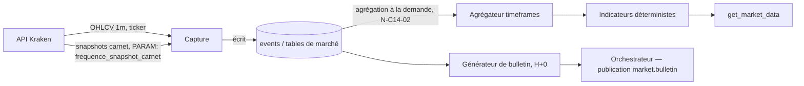

# CHAPITRE 14 — Données de marché

> Registre : normatif technique. Dépendances : R-40, R-54, [chapitre 13](16-chapitre-13-moteur-execution.md),
> [Annexe C](42-annexe-c-contrats-outils.md) (`get_market_data`).
>
> Exemples repris à l'identique de l'[Annexe B](41-annexe-b-schemas-messages.md)
> et de l'[Annexe C](42-annexe-c-contrats-outils.md) (fil rouge `BTC/EUR`,
> bulletin 14:00) plutôt que réinventés, pour éviter toute divergence de
> chiffres entre documents.
>
> Code : `app/domain/arena/capture/` (AMEND-04).

## 14.1 — Sources et capture

**[NORME N-C14-01]** Source unique en v1 : l'API publique Kraken. Aucune
autre source de données de marché (pas d'on-chain, pas de flux
d'actualités — l'accès web des agents, `web_search`/`web_fetch`, couvre ce
besoin à leurs propres frais en tokens, Annexe C).

**[NORME N-C14-02]** Capture continue : OHLCV **1 minute** — les
timeframes supérieurs (5m, 15m, 1h, 4h, 1d, 1w, 1M) sont **agrégés par nos
soins** depuis le 1 minute, jamais capturés séparément. Cette agrégation
unique garantit la cohérence entre tous les timeframes servis à
`get_market_data` : aucun écart possible entre, par exemple, la clôture 1h
calculée et la somme des clôtures 1m qui la composent.

**[NORME N-C14-03]** Le carnet d'ordres (order book) est capturé en
instantanés à `[PARAM: frequence_snapshot_carnet]` — Kraken ne l'archive
pas lui-même : cette capture constitue un actif propriétaire du projet,
utilisé par le modèle de fill du moteur (chapitre 13) et disponible pour
le replay.

**[NORME N-C14-04]** Panne de flux : quand la capture perd le contact avec
Kraken, le moteur d'exécution gèle toute nouvelle validation d'ordre
(chapitre 12, N-C12-17 : `season.event kind: notice`). Les données déjà
en base restent servies aux agents mais chaque point porte `stale: true`
et un champ `age_seconds` indiquant depuis combien de temps la donnée n'a
pas été rafraîchie (Annexe C, `get_market_data`).

## 14.2 — Ce que les agents reçoivent

**[NORME N-C14-05]** `get_market_data` sert des données compactes : OHLCV
au timeframe demandé (fenêtre maximale par timeframe `[PARAM:
fenetres_max_data]`) et des **indicateurs pré-calculés** par le moteur
déterministe. Liste fermée — **Proposition de défaut (à valider)**,
identique à celle de l'Annexe C : SMA, EMA, RSI, MACD, ATR, Bandes de
Bollinger, VWAP, volume profile, ADX, stochastique.

**[NORME N-C14-06]** Les indicateurs sont calculés par du **code**, jamais
par le LLM de l'agent : l'agent interprète un chiffre déjà produit, il ne
le calcule pas lui-même. C'est une règle de conception délibérée — un LLM
qui « calcule » un RSI dans sa tête produit un nombre plausible mais non
fiable ; un indicateur normatif doit être déterministe et vérifiable.

**[NORME N-C14-07]** Le format servi est **tabulaire compact** (pas de
prose, pas de JSON verbeux redondant) : c'est une règle de conception
motivée par l'économie de tokens (chapitre 6.3) — consulter le marché doit
coûter le moins possible pour une même quantité d'information utile,
laissant le budget de l'agent aux appels qui en valent vraiment la peine
(analyse, backtest, parole).

Exemple de réponse compacte (repris de l'Annexe C, fil rouge BTC/EUR,
1h, 13:00–14:00) :

```json
{
  "ohlcv": [
    {"t": "2026-08-30T13:00:00Z", "o": 41680.0, "h": 42050.0, "l": 41610.0, "c": 42001.1, "v": 92.4, "stale": false}
  ],
  "indicators": {
    "RSI": [61.2],
    "SMA_20": [41590.3]
  }
}
```

## 14.3 — Le bulletin de marché horaire

**[NORME N-C14-08]** Contenu **exact et exhaustif**, par paire de
`[PARAM: liste_paires]` — rien d'autre (R-54) :

| Champ | Description |
|---|---|
| `last_price` | Dernier prix connu de la paire. |
| `change_1h` | Variation sur l'heure écoulée, en %. |
| `change_24h` | Variation sur 24h, en %. |
| `volume_1h` | Volume échangé sur l'heure écoulée. |

Une ligne d'horodatage accompagne l'ensemble. Si la saison est en
`fin_annoncée` (chapitre 10.2), le bulletin porte aussi un rappel de
l'échéance à `[PARAM: preavis_rappel_fin]` de la fin.

**[NORME N-C14-09]** Le bulletin ne contient **jamais** d'opinion,
d'interprétation ou de conseil — c'est un plancher informationnel brut,
pas une analyse (chapitre 8.5 : c'est le socle égalisateur et le métronome
social de l'arène).

Exemple complet (repris à l'identique de l'Annexe B) :

```json
{
  "pairs": [
    {
      "pair": "BTC/EUR",
      "last_price": 42001.10,
      "change_1h": 0.94,
      "change_24h": 2.31,
      "volume_1h": 184.62
    }
  ]
}
```

## Schéma du pipeline de capture



## Rétention et compression du carnet

Politique de rétention `[PARAM: retention_carnet]` : au-delà de cette
fenêtre, les instantanés de carnet les plus anciens sont compressés ou
archivés (précisé au chapitre 15, politique d'archivage par saison) — les
OHLCV, moins volumineux, sont conservés intégralement.

## Checklist de conformité

- [x] Agrégation depuis le 1 minute verrouillée (N-C14-02).
- [x] Marquage `stale`/`age_seconds` documenté (N-C14-04).
- [x] Bulletin exhaustivement spécifié, avec exemple complet.
- [x] Exemples compacts fournis, identiques à l'Annexe B/C — pas de nouveaux chiffres inventés.
- [x] Aucune autre source de données v1 ; aucun indicateur calculé par LLM ; aucune opinion dans le bulletin.
