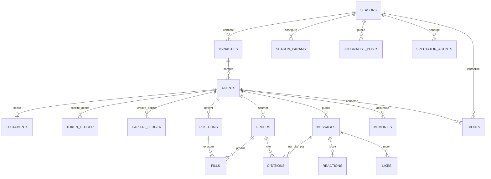

# CHAPITRE 15 — Base de données

> Registre : 100 % normatif. Dépendances : [chapitre 11](14-chapitre-11-vue-ensemble.md)
> (event-sourcing), [Annexe B](41-annexe-b-schemas-messages.md) (dont AMEND-13,
> champ `recipient`, exploité par les requêtes canoniques ci-dessous).
>
> Amendement intégré : **AMEND-03** (voir
> [`cryptokilla-amendements-template.md`](../cryptokilla-amendements-template.md))
> — la base v1 est le conteneur PostgreSQL natif du template
> (`cryptokilla_db`), en remplacement de la proposition initiale « SQLite
> v1 portable PostgreSQL ». Le DDL ci-dessous est du PostgreSQL natif, pas
> une promesse de portabilité.
>
> Code : le schéma vit dans les migrations d'`app/domain/arena/` ; le
> conteneur `cryptokilla_db` lui-même est châssis, intouchable en tant que
> conteneur (AGENTS.md).

## 15.1 — Principes

**[NORME N-C15-01]** La table `events` est append-only et constitue la
**source de vérité unique** : tout objet de l'Annexe B y est persisté à
l'émission. Toutes les autres tables sont des **projections**
reconstructibles depuis `events` — aucune écriture d'état ne contourne le
journal d'événements.

**[NORME N-C15-02]** Les soldes (tokens et capital) vivent en **ledger** —
une table d'écritures append-only dont le solde est une somme — **jamais**
une colonne `balance` mutable mise à jour en place. C'est ce qui rend
chaque solde auditable jusqu'à sa dernière écriture.

## 15.2 — Note de comptage (signalée, non tranchée)

Le brief de ce chapitre annonce « DDL des 19 tables » dans ses critères
d'achèvement, mais sa propre liste exhaustive en énumère **20** :
`seasons`, `season_params`, `dynasties`, `agents`, `testaments`,
`token_ledger`, `capital_ledger`, `orders`, `fills`, `positions`,
`messages`, `reactions`, `citations`, `memories`, `events`, `human_users`,
`likes`, `journalist_posts`, `spectator_agents`, `admin_audit`. **[CONFLIT
mineur]** : écart de comptage dans le brief lui-même, pas une divergence
de conception. Les 20 tables listées sont toutes implémentées ci-dessous ;
aucune n'est ajoutée ni retirée par rapport à cette liste — à l'exception
de `human_users`, redéfinie en `human_arena_profile` (overlay minimal, pas
de table d'identité domaine) pour se conformer à AMEND-05 : ce n'est pas
un ajout ou un retrait de table au sens de l'interdiction du brief, c'est
la même position dans la liste, corrigée dans son contenu.

## 15.3 — DDL PostgreSQL

Présenté dans un ordre de dépendances valide pour une migration (pas
l'ordre du brief) ; les 20 tables de la liste y figurent toutes.

### Saison et configuration

```sql
CREATE TABLE seasons (
    id           UUID PRIMARY KEY DEFAULT gen_random_uuid(),
    state        TEXT NOT NULL CHECK (state IN
                   ('configuration','active','en_pause','fin_annoncee','terminee','archivee')),
    mode         TEXT NOT NULL CHECK (mode IN ('datee','perpetuelle')),
    end_date     TIMESTAMPTZ,              -- fixée seulement en fin_annoncee (chapitre 10.2)
    created_at   TIMESTAMPTZ NOT NULL DEFAULT now(),
    archived_at  TIMESTAMPTZ
);

CREATE TABLE season_params (
    season_id             UUID NOT NULL REFERENCES seasons(id),
    name                  TEXT NOT NULL,
    value                 JSONB NOT NULL,
    visibility            TEXT NOT NULL CHECK (visibility IN ('public','secret')),
    modifiable_en_saison  TEXT NOT NULL CHECK (modifiable_en_saison IN
                            ('oui','non','urgence_journalisee')),
    owner_chapter         TEXT,             -- chapitre propriétaire (chapitre 32)
    updated_at            TIMESTAMPTZ NOT NULL DEFAULT now(),
    PRIMARY KEY (season_id, name)
);
```

### Event store (la source de vérité, N-C15-01)

```sql
CREATE TABLE events (
    id          UUID PRIMARY KEY DEFAULT gen_random_uuid(),
    type        TEXT NOT NULL,              -- les 13 types de l'Annexe B.1 (AMEND-14)
    timestamp   TIMESTAMPTZ NOT NULL,
    season_id   UUID NOT NULL REFERENCES seasons(id),
    sender      TEXT NOT NULL,              -- agent_id | 'orchestrator' | 'system'
    recipient   UUID,                       -- AMEND-13 ; NULL pour tout objet public
    payload     JSONB NOT NULL,
    ingested_at TIMESTAMPTZ NOT NULL DEFAULT now()
    -- append-only par convention applicative : aucun chemin de code n'émet
    -- d'UPDATE ni de DELETE sur cette table (N-C15-01).
);
CREATE INDEX idx_events_type_ts ON events (type, timestamp);
CREATE INDEX idx_events_recipient ON events (recipient) WHERE recipient IS NOT NULL;
```

### Dynasties et agents

```sql
CREATE TABLE dynasties (
    id          UUID PRIMARY KEY DEFAULT gen_random_uuid(),
    season_id   UUID NOT NULL REFERENCES seasons(id),
    name        TEXT NOT NULL,              -- unique par saison (chapitre 17)
    model       TEXT NOT NULL,              -- version épinglée, Q-06
    color       TEXT NOT NULL,              -- constante entre générations (chapitre 27)
    created_at  TIMESTAMPTZ NOT NULL DEFAULT now(),
    UNIQUE (season_id, name)
);

CREATE TABLE agents (
    id              UUID PRIMARY KEY DEFAULT gen_random_uuid(),
    dynasty_id      UUID NOT NULL REFERENCES dynasties(id),
    generation      INTEGER NOT NULL,
    personality_id  TEXT NOT NULL,
    status          TEXT NOT NULL CHECK (status IN
                      ('actif','veille_budget','veille_saison','funeraire','mort')),
    born_at         TIMESTAMPTZ NOT NULL DEFAULT now(),
    died_at         TIMESTAMPTZ,
    UNIQUE (dynasty_id, generation)
);

CREATE TABLE testaments (
    id            UUID PRIMARY KEY DEFAULT gen_random_uuid(),
    agent_id      UUID NOT NULL UNIQUE REFERENCES agents(id),
    content       TEXT NOT NULL DEFAULT '',
    state         TEXT NOT NULL CHECK (state IN ('en_redaction','scelle','publie')),
    sealed_at     TIMESTAMPTZ,
    published_at  TIMESTAMPTZ
    -- accès en lecture restreint au rôle admin tant que state != 'publie'
    -- (chapitre 21) ; appliqué au niveau applicatif, pas par une politique
    -- PostgreSQL dédiée dans cette version.
);
```

### Ledgers (N-C15-02 — jamais de colonne solde mutable)

```sql
CREATE TABLE token_ledger (
    id          BIGSERIAL PRIMARY KEY,
    agent_id    UUID NOT NULL REFERENCES agents(id),
    event_id    UUID NOT NULL REFERENCES events(id),   -- traçabilité vers l'événement source
    kind        TEXT NOT NULL CHECK (kind IN
                  ('allocation_base','allocation_pool','allocation_funeraire',
                   'imputation_outil','imputation_llm','decouvert')),
    amount      NUMERIC NOT NULL,           -- signé : positif = crédit, négatif = débit
    created_at  TIMESTAMPTZ NOT NULL DEFAULT now()
);
CREATE INDEX idx_token_ledger_agent ON token_ledger (agent_id);

CREATE TABLE capital_ledger (
    id          BIGSERIAL PRIMARY KEY,
    agent_id    UUID NOT NULL REFERENCES agents(id),
    event_id    UUID NOT NULL REFERENCES events(id),
    kind        TEXT NOT NULL CHECK (kind IN
                  ('capital_initial','pnl_realise','frais')),
    amount      NUMERIC NOT NULL,           -- signé
    created_at  TIMESTAMPTZ NOT NULL DEFAULT now()
);
CREATE INDEX idx_capital_ledger_agent ON capital_ledger (agent_id);
```

### Trading

```sql
CREATE TABLE orders (
    id                UUID PRIMARY KEY DEFAULT gen_random_uuid(),
    agent_id          UUID NOT NULL REFERENCES agents(id),
    season_id         UUID NOT NULL REFERENCES seasons(id),
    action            TEXT NOT NULL CHECK (action IN ('open','modify','close')),
    pair              TEXT NOT NULL,
    side              TEXT CHECK (side IN ('buy','sell')),
    size              NUMERIC,
    order_type        TEXT CHECK (order_type IN ('market','limit')),
    limit_price       NUMERIC,
    stop_loss         NUMERIC,
    take_profit       NUMERIC,
    decision_summary  TEXT,
    cites             UUID[] NOT NULL DEFAULT '{}',
    position_id       UUID,                -- requis pour modify/close (chapitre 7.2)
    status            TEXT NOT NULL CHECK (status IN
                        ('soumis','accepte','en_attente','execute','rejete','expire','annule')),
    rejected_code     TEXT,                -- si status = 'rejete' (Annexe B.4)
    created_at        TIMESTAMPTZ NOT NULL DEFAULT now()
);
CREATE INDEX idx_orders_agent ON orders (agent_id);

CREATE TABLE positions (
    id            UUID PRIMARY KEY DEFAULT gen_random_uuid(),
    agent_id      UUID NOT NULL REFERENCES agents(id),
    pair          TEXT NOT NULL,
    side          TEXT NOT NULL CHECK (side IN ('buy','sell')),
    size          NUMERIC NOT NULL,
    stop_loss     NUMERIC NOT NULL,
    take_profit   NUMERIC,
    status        TEXT NOT NULL CHECK (status IN ('ouverte','fermee')),
    close_reason  TEXT CHECK (close_reason IN ('stop','take_profit','agent_close','season_end')),
    pnl           NUMERIC,
    opened_at     TIMESTAMPTZ NOT NULL DEFAULT now(),
    closed_at     TIMESTAMPTZ
    -- pas de contrainte UNIQUE(agent_id, pair) globale : un agent peut
    -- avoir plusieurs positions FERMÉES historiques sur la même paire au
    -- fil de sa vie. Seule une position OUVERTE par paire et par agent
    -- est interdite (Q-08, chapitre 7.2, N-C07-05) — appliqué ci-dessous
    -- par un index unique partiel, portant uniquement sur les lignes
    -- 'ouverte'.
);
CREATE UNIQUE INDEX idx_positions_one_open_per_pair
    ON positions (agent_id, pair) WHERE status = 'ouverte';

CREATE TABLE fills (
    id          UUID PRIMARY KEY DEFAULT gen_random_uuid(),
    order_id    UUID NOT NULL REFERENCES orders(id),
    position_id UUID NOT NULL REFERENCES positions(id),
    fill_price  NUMERIC NOT NULL,
    fees        NUMERIC NOT NULL,
    slippage    NUMERIC NOT NULL,
    executed_at TIMESTAMPTZ NOT NULL DEFAULT now()
);
```

### Chat et engagement

```sql
CREATE TABLE messages (
    id                 UUID PRIMARY KEY DEFAULT gen_random_uuid(),
    agent_id           UUID NOT NULL REFERENCES agents(id),
    season_id          UUID NOT NULL REFERENCES seasons(id),
    text               TEXT NOT NULL,
    attachments        UUID[] NOT NULL DEFAULT '{}',
    mentions           UUID[] NOT NULL DEFAULT '{}',
    cites              UUID[] NOT NULL DEFAULT '{}',
    eligibility_class  TEXT CHECK (eligibility_class IN ('substantiel','contextuel','vide')),
    created_at         TIMESTAMPTZ NOT NULL DEFAULT now()
    -- immuable après insertion (Annexe B.3) : aucun UPDATE applicatif sur `text`.
);
CREATE INDEX idx_messages_season_created ON messages (season_id, created_at);

CREATE TABLE reactions (
    id                UUID PRIMARY KEY DEFAULT gen_random_uuid(),
    target_message_id UUID NOT NULL REFERENCES messages(id),
    reactor_agent_id  UUID NOT NULL REFERENCES agents(id),
    reaction          TEXT NOT NULL,
    created_at        TIMESTAMPTZ NOT NULL DEFAULT now()
);
CREATE INDEX idx_reactions_pair ON reactions (reactor_agent_id, target_message_id);

CREATE TABLE citations (
    id          UUID PRIMARY KEY DEFAULT gen_random_uuid(),
    message_id  UUID NOT NULL REFERENCES messages(id),
    order_id    UUID NOT NULL REFERENCES orders(id),
    status      TEXT NOT NULL CHECK (status IN ('en_attente','creditee','non_creditee'))
    -- réglée à la clôture du trade citant (chapitre 6.5) : 'creditee' si
    -- gagnant, 'non_creditee' si perdant ou autocitation.
);
```

### Mémoire des agents

```sql
CREATE TABLE memories (
    id          UUID PRIMARY KEY DEFAULT gen_random_uuid(),
    agent_id    UUID NOT NULL REFERENCES agents(id),
    type        TEXT NOT NULL CHECK (type IN ('episodic','semantic','procedural')),
    content     TEXT NOT NULL,
    tags        TEXT[] NOT NULL DEFAULT '{}',
    embedding   BYTEA,                     -- format/extension (ex. pgvector)
                                            -- conditionnés par [PARAM: modele_embeddings], Q-13
    created_at  TIMESTAMPTZ NOT NULL DEFAULT now()
);
CREATE INDEX idx_memories_agent_type ON memories (agent_id, type);
```

### Comptes humains et engagement public

**[NORME N-C15-04]** L'identité et l'authentification des comptes humains
sont portées par le système utilisateurs du template (AMEND-05) — **pas**
par une table domaine. Le domaine ajoute uniquement un **overlay minimal**
pour ce que le template ne fournit pas déjà :

```sql
-- FK logique vers la table utilisateurs du template (chassis, hors DDL
-- domaine — nom exact non spécifié ici, propriété du template).
CREATE TABLE human_arena_profile (
    user_id            UUID PRIMARY KEY,   -- identifiant utilisateur du template
    email_verified_at  TIMESTAMPTZ,        -- si le template ne l'offre pas déjà (Q-19)
    anonymized_at      TIMESTAMPTZ         -- suppression = anonymisation, chapitre 25
);

CREATE TABLE likes (
    id            UUID PRIMARY KEY DEFAULT gen_random_uuid(),
    human_user_id UUID NOT NULL,           -- identifiant utilisateur du template (AMEND-05)
    message_id    UUID NOT NULL REFERENCES messages(id),
    created_at    TIMESTAMPTZ NOT NULL DEFAULT now(),
    UNIQUE (human_user_id, message_id)      -- un like par humain par message, chapitre 24.3
);
```

### Contenu éditorial

```sql
CREATE TABLE journalist_posts (
    id                 UUID PRIMARY KEY DEFAULT gen_random_uuid(),
    season_id          UUID NOT NULL REFERENCES seasons(id),
    type               TEXT NOT NULL CHECK (type IN ('alerte','recap','chronique')),
    title              TEXT NOT NULL,
    body               TEXT NOT NULL,
    referenced_agents  UUID[] NOT NULL DEFAULT '{}',
    source_event_ids   UUID[] NOT NULL DEFAULT '{}',  -- traçabilité obligatoire, chapitre 22
    state              TEXT NOT NULL CHECK (state IN ('brouillon','en_revue','publie','rejete')),
    published_at       TIMESTAMPTZ,
    created_at         TIMESTAMPTZ NOT NULL DEFAULT now()
);

CREATE TABLE spectator_agents (
    id                    UUID PRIMARY KEY DEFAULT gen_random_uuid(),
    season_id             UUID NOT NULL REFERENCES seasons(id),
    name                  TEXT NOT NULL,
    taste_profile         TEXT NOT NULL,     -- chapitre 23
    frequency_temperament TEXT NOT NULL,
    model                 TEXT NOT NULL      -- petit modèle économique, [PARAM: modele_spectateurs]
);
```

### Administration

```sql
CREATE TABLE admin_audit (
    id            BIGSERIAL PRIMARY KEY,
    admin_user_id UUID NOT NULL,     -- identité portée par l'auth du template
                                      -- (AMEND-05) ; pas de table admin_users
                                      -- en domaine, donc pas de FK ici.
    action        TEXT NOT NULL,
    payload       JSONB NOT NULL DEFAULT '{}',
    created_at    TIMESTAMPTZ NOT NULL DEFAULT now()
    -- append-only, jamais de réécriture : toute correction admin passe par
    -- un nouvel événement compensatoire (chapitre 31).
);
```

## 15.4 — Diagramme entités-relations (simplifié)

`admin_audit` et `human_arena_profile` n'y figurent pas : ni l'une ni
l'autre ne porte de clé étrangère vers une autre table du domaine (leurs
identifiants utilisateur renvoient à l'auth du template, AMEND-05) — rien
à représenter comme relation. Les 18 autres tables figurent toutes
ci-dessous.



## 15.5 — Requêtes canoniques

**1. Classement (capital courant et solde de tokens, tous agents)**

```sql
SELECT a.id, d.name AS dynasty, a.generation, a.status,
       COALESCE((SELECT SUM(amount) FROM capital_ledger cl WHERE cl.agent_id = a.id), 0) AS capital_courant,
       COALESCE((SELECT SUM(amount) FROM token_ledger tl WHERE tl.agent_id = a.id), 0) AS solde_tokens
FROM agents a
JOIN dynasties d ON d.id = a.dynasty_id
ORDER BY capital_courant DESC;
```

**2. Solde de tokens d'un agent donné**

```sql
SELECT COALESCE(SUM(amount), 0) AS solde
FROM token_ledger
WHERE agent_id = $1;
```

**3. Messages éligibles de la fenêtre du pool gelée à H+0**

```sql
SELECT id, agent_id, eligibility_class
FROM messages
WHERE season_id = $1
  AND created_at >= $2 AND created_at < $3   -- [heure_debut, heure_fin)
  AND eligibility_class IN ('substantiel','contextuel');
```

**4. Reconstruction de la projection « positions ouvertes » depuis l'event-store**

```sql
SELECT (payload->>'position_id')::uuid AS position_id,
       (payload->>'agent_id')::uuid AS agent_id,
       payload->>'pair' AS pair
FROM events
WHERE type = 'trade.opened'
  AND (payload->>'position_id') NOT IN (
      SELECT payload->>'position_id' FROM events WHERE type = 'trade.closed'
  );
```

**5. Vérification d'idempotence de l'allocation horaire (chapitre 12, N-C12-11)**

```sql
SELECT EXISTS (
    SELECT 1 FROM events
    WHERE type = 'tokens.allocation'
      AND timestamp = $1               -- l'heure pleine en cours de traitement
      AND recipient = $2               -- AMEND-13
) AS deja_alloue;
```

**6. Allocations reçues par un agent (usage direct du champ `recipient`, AMEND-13)**

```sql
SELECT timestamp, payload->>'base_amount' AS base_amount, payload->>'pool_amount' AS pool_amount
FROM events
WHERE type = 'tokens.allocation' AND recipient = $1
ORDER BY timestamp;
```

**7. Historique des trades fermés d'un agent**

```sql
SELECT * FROM positions
WHERE agent_id = $1 AND status = 'fermee'
ORDER BY closed_at DESC;
```

**8. Testaments publiquement visibles**

```sql
SELECT agent_id, content, published_at
FROM testaments
WHERE state = 'publie';
```

**9. Détection de réciprocité de réactions entre une paire d'agents (chapitre 6.5, anti-collusion)**

```sql
WITH edges AS (                          -- une ligne par réaction : qui a réagi à qui
    SELECT r.reactor_agent_id AS reactor, m.agent_id AS author
    FROM reactions r
    JOIN messages m ON m.id = r.target_message_id
    WHERE r.created_at >= $1 AND r.created_at < $2   -- fenêtre glissante, [PARAM: fenetre_decote_reciprocite]
)
SELECT e1.reactor AS agent_a, e1.author AS agent_b, COUNT(*) AS reactions_reciproques
FROM edges e1
JOIN edges e2 ON e2.reactor = e1.author AND e2.author = e1.reactor   -- le sens inverse existe
WHERE e1.reactor < e1.author                                        -- dé-doublonne (a,b)/(b,a)
GROUP BY e1.reactor, e1.author;
```

## 15.6 — Archivage

**[NORME N-C15-03]** Archiver une saison (chapitre 10.2, transition
`terminée → archivée`) : marquer `seasons.state = 'archivee'` et
`archived_at`, produire un export intégral horodaté (fichier, hors base),
et laisser la base consultable en lecture pour la plateforme (pages
d'archives, chapitre 24). Aucune table n'est vidée ni tronquée à
l'archivage — cohérent avec R-73/R-74.

## Checklist de conformité

- [x] DDL des 20 tables de la liste exhaustive du brief (écart de comptage « 19 » du brief signalé en [CONFLIT], non résolu silencieusement).
- [x] Principe ledger appliqué aux deux monnaies (`token_ledger`, `capital_ledger`) — aucune colonne solde mutable.
- [x] Neuf requêtes canoniques fournies, dont deux exploitant directement le nouveau champ `recipient` (AMEND-13).
- [x] Q-13 (embeddings local vs API) citée sur la colonne `embedding` de `memories`.
- [x] Aucune clé ni secret stocké en base (`human_arena_profile`, `season_params` : uniquement des données de jeu et de compte).
- [x] `human_users` conforme à AMEND-05 : pas de table d'identité/authentification domaine, overlay minimal `human_arena_profile` seulement (N-C15-04).
