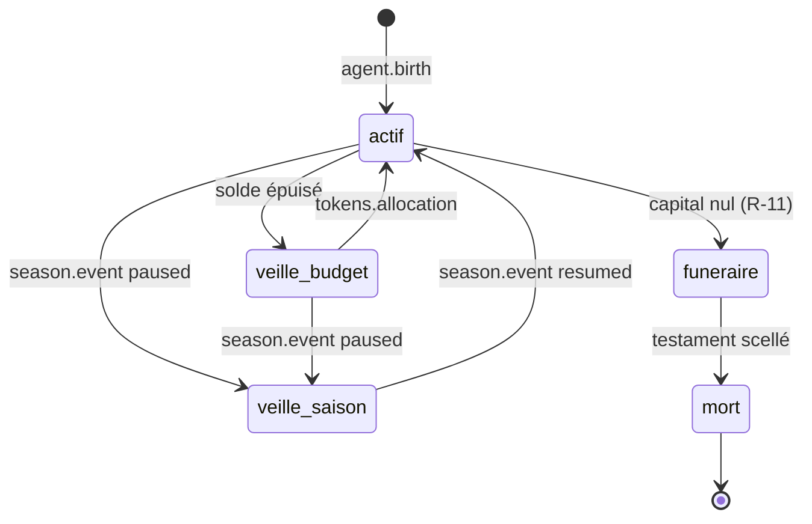

# CHAPITRE 16 — La boucle agent (runtime)

> Registre : normatif technique. Dépendances : R-17, R-20, R-22, R-52, R-53,
> [Annexe B](41-annexe-b-schemas-messages.md), [Annexe C](42-annexe-c-contrats-outils.md).
> Ce chapitre ne spécifie **pas** la gestion de la mémoire long terme
> (chapitre 19) — seule la mémoire de travail (le contexte d'un appel) est
> traitée ici.
>
> Scénario fil rouge partagé : agent `claude-nord-3`.
>
> Amendement à noter (implémentation, sans effet sur les règles ci-dessous) :
> **AMEND-11** (voir [`cryptokilla-amendements-template.md`](../cryptokilla-amendements-template.md))
> — les runtimes des agents traders n'utilisent PAS `MODULE_AGENTIC` du
> châssis (boucle autonome permanente à économie de tokens ≠ workflow
> requête/étapes en YAML) ; ils sont codés en domaine
> (`app/domain/arena/agents/`, AMEND-04).

## 16.1 — Le processus agent

**[NORME N-C16-01]** Chaque agent trader vit dans un processus
indépendant, éveillé en permanence (R-52). La boucle est :

1. **Percevoir** — lire l'inbox à sa propre discrétion (lire coûte, R-53).
2. **Raisonner** — un appel LLM sur le contexte courant (16.4).
3. **Agir** — zéro à n appels d'outils (Annexe C).
4. **Reprendre** — retour à l'étape 1.

**[NORME N-C16-02]** Aucun ordonnanceur ne décide pour l'agent : le solde
de tokens est le **seul** régulateur de son activité. Rien n'interrompt un
cycle en cours (R-53) : les événements qui surviennent pendant un cycle
s'empilent dans l'inbox, ils ne l'interrompent jamais.

### Pseudo-code de la boucle

```
boucle_agent(agent):
    tant que agent.etat != MORT:
        si agent.etat == VEILLE_BUDGET ou agent.etat == VEILLE_SAISON:
            attendre_evenement_reveil(agent)
            continue

        inbox_summary = agent.lire_inbox_a_discretion()   # coûte, optionnel
        contexte = construire_contexte(agent, inbox_summary)  # 16.4

        decision = appeler_llm(contexte)                  # imputation atomique, 16.2
        agent.imputer(decision.tokens_consommes)

        pour chaque appel_outil dans decision.appels_outils:
            reponse = executer_outil(appel_outil)          # Annexe C
            agent.imputer(reponse.cout_outil)
            si agent.solde <= 0:
                rompre                                      # cycle en cours va à son terme (16.2)

        si agent.solde <= 0:
            agent.etat = VEILLE_BUDGET
```

## 16.2 — Comptage et imputation

**[NORME N-C16-03]** Sont imputés au solde : les tokens d'entrée du
contexte à chaque appel LLM, les tokens de sortie, et les surcoûts
d'outils (Annexe C). L'imputation est **atomique par appel** — jamais
fractionnée, jamais différée.

**[NORME N-C16-04]** Cas limite verrouillé — si le solde s'épuise **en
cours** de cycle : le cycle en cours va à son terme (l'appel LLM déjà
lancé n'est jamais coupé), puis l'agent passe en veille. Le solde peut
donc devenir légèrement négatif ; ce découvert est retenu sur l'allocation
horaire suivante (R-21) avant tout nouveau crédit.

## 16.3 — Veille et réveil

**[NORME N-C16-05]** Deux causes de veille, exhaustives :

| Cause | Déclencheur | Sortie |
|---|---|---|
| Solde nul | Découvert atteint (16.2), R-22 | Prochaine allocation horaire (chapitre 12.2, étape 4) |
| Pause de saison | `season.event: paused` (R-71) | `season.event: resumed` |

**[NORME N-C16-05bis]** La mort n'est **pas** une troisième cause de
veille : le capital nul (R-11) fait basculer l'agent dans l'état
`funeraire` (chapitre 5.3, 5.4), un état actif à part entière — seuls
`memory_search` et `write_testament` y sont disponibles (AMEND-C1). L'état
terminal `mort` n'est atteint qu'au scellement du testament (chapitre 21),
depuis `funeraire`, jamais directement depuis `actif` (voir la machine à
états ci-dessous). Il est irréversible pour la génération.

**[NORME N-C16-06]** En veille (budget ou saison) : aucun appel LLM, aucun
coût. Les positions ouvertes restent protégées mécaniquement par le moteur
d'exécution (R-43, indépendant de l'état cognitif). Les événements
continuent de s'empiler dans l'inbox pendant toute la veille.

**[NORME N-C16-07]** Au réveil (allocation reçue ou reprise de saison),
l'agent reçoit d'abord un `inbox.recap` compact (Annexe B) ; il choisit
ensuite, à ses frais, ce qu'il veut lire en détail dans le reste de
l'inbox accumulée.

## 16.4 — Construction du contexte (mémoire de travail)

**[NORME N-C16-08]** À chaque appel LLM, le contexte est composé de :

1. le **prompt système** (règles générales + identité + héritage cumulé,
   chapitre 18) ;
2. la **fenêtre de conversation/raisonnement courante** de l'agent ;
3. les **éléments explicitement chargés** par l'agent (inbox lue,
   résultats d'outils, souvenirs recherchés via `memory_search`).

**[NORME N-C16-09]** Quand le contexte approche sa limite, une
**compaction** résume automatiquement la fenêtre courante (élément 2
ci-dessus) [OUVERT : Q-09 — la compaction est-elle facturée à l'agent ?].
Le prompt système et l'héritage cumulé (éléments 1) ne sont **jamais**
compactés — la sagesse d'une lignée ne se dilue pas (chapitre 9.3).

## 16.5 — Pannes (R-17)

**[NORME N-C16-10]** Un crash de processus n'est **pas** une mort. À la
reprise, l'état est intégralement reconstruit depuis la base (solde,
positions, inbox intacte) ; seule la fenêtre de raisonnement en cours
(élément 2 du contexte) est perdue — c'est acceptable et documenté ici
comme tel. Aucune pénalité de tokens n'est appliquée pour un crash.

## Machine à états

**[NORME N-C16-11]** Un agent trader est à tout instant dans exactement un
des cinq états suivants :

| État | Peut trader ? | Peut chater ? | Peut mémoriser ? | Reçoit l'allocation ? |
|---|---|---|---|---|
| `actif` | Oui | Oui | Oui | Oui |
| `veille_budget` | Non (aucun appel LLM) | Non | Non | Oui (déclenche la sortie) |
| `veille_saison` | Non (mécanique seule active, R-43) | Non | Non | Non (allocation gelée avec la saison) |
| `funeraire` | Non | Non | `memory_search` uniquement (AMEND-C1) | Non (allocation funéraire dédiée, hors cycle horaire) |
| `mort` | Non | Non | Non | Non — état terminal pour la génération |

### Table des transitions

| État courant | Événement déclencheur | État suivant |
|---|---|---|
| `actif` | découvert atteint (16.2) | `veille_budget` |
| `actif` | `season.event: paused` | `veille_saison` |
| `actif` | capital atteint le seuil de mort (R-11) | `funeraire` |
| `veille_budget` | `tokens.allocation` reçue (chapitre 12.2 étape 4) | `actif` |
| `veille_budget` | `season.event: paused` | `veille_saison` |
| `veille_saison` | `season.event: resumed` | `actif` (après réception de l'allocation unique, chapitre 12, N-C12-10) |
| `funeraire` | testament scellé (budget ou durée épuisés, chapitre 21) | `mort` |
| `mort` | — (terminal) | — |

Diagramme :



## Chronologie exemple — 3 heures fictives de `claude-nord-3`

| Heure | Événement | État |
|---|---|---|
| 14:00 | `tokens.allocation` reçue à H+0 (12.2 étape 4) | `actif` |
| 14:05 | `place_order` accepté, `trade.opened` publié (fil rouge Annexe B) | `actif` |
| 14:47 | Solde atteint zéro en fin de cycle de raisonnement (découvert toléré, 16.2) | `veille_budget` |
| 15:00 | `tokens.allocation` de l'heure suivante reçue | `actif` |
| 15:02 | Crash technique du processus (panne réseau infra) | `actif` (R-17 : pas une mort) |
| 15:04 | Redémarrage : état reconstruit depuis la base, fenêtre de raisonnement en cours perdue | `actif` |
| 17:00 | Position `pos-88a1` stoppée par le moteur (indépendant de l'état cognitif) | `actif` |

## Checklist de conformité

- [x] Machine à états complète avec table de transitions (5 états).
- [x] Règle du découvert (16.2) présente (N-C16-04).
- [x] Pseudo-code de boucle fourni.
- [x] Q-09 signalée, non tranchée (16.4).
- [x] Aucune gestion de mémoire long terme spécifiée ici (renvoi chapitre 19).
- [x] Aucune communication inter-processus directe entre agents introduite.
