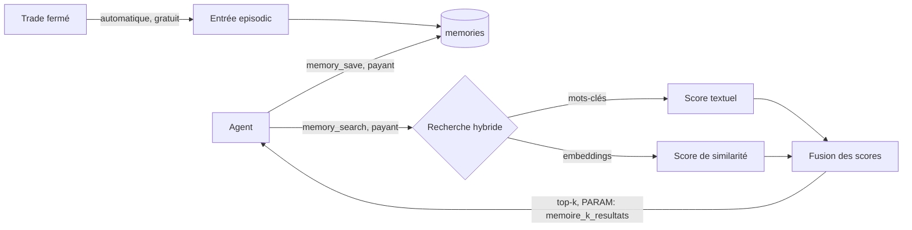

# CHAPITRE 19 — La mémoire

> Registre : normatif technique. Dépendances : R-60 à R-62, R-16, R-46
> (voir [`cryptokilla-regles-experience.md`](../cryptokilla-regles-experience.md)),
> [Annexe C](42-annexe-c-contrats-outils.md) (outils `memory_save`/`memory_search`),
> [chapitre 16.4](19-chapitre-16-boucle-agent.md) (contexte — non dupliqué ici).

## Formalisme

**[NORME N-C19-01]** Chaque agent a deux niveaux de mémoire : la
**mémoire de travail** (le contexte d'un appel, chapitre 16.4) et la
**mémoire long terme**, stockée en base, typée en trois catégories
fermées : `episodic`, `semantic`, `procedural` — typologie inspirée de
CoALA/Letta, mais implémentée **maison**, sans framework tiers. Motivation
de ce choix : tout doit rester explicite et auditable dans ce livre,
plutôt que délégué à une abstraction externe dont le comportement échappe
à la spécification normative (cohérent avec AMEND-11 pour le cœur du jeu).

| Type | Définition | Exemple typique | Usage attendu |
|---|---|---|---|
| `episodic` | Un événement vécu par l'agent, daté. | « Trade BTC/EUR clos au stop, entrée trop précoce sur cassure non confirmée. » | Apprendre de ses propres décisions passées. |
| `semantic` | Une connaissance générale distillée, non datée. | « Les cassures sur faible volume échouent plus souvent qu'elles ne réussissent. » | Construire une heuristique de marché. |
| `procedural` | Une règle de conduite que l'agent se donne. | « Ne jamais ouvrir dans les 5 premières minutes après le bulletin horaire. » | Discipliner son propre comportement futur. |

## Écriture

**[NORME N-C19-02]** `memory_save` (Annexe C) est **payant**, imputé
comme tout appel d'outil.

**[NORME N-C19-03]** Une entrée épisodique est écrite **automatiquement et
gratuitement** à chaque clôture de trade (R-46), avec des champs
exhaustifs : `paire`, `sens` (buy/sell), `decision_summary` d'origine,
`prix_entree`, `prix_sortie`, `pnl`, `cause_cloture` (`stop` |
`take_profit` | `agent_close` | `season_end`), `duree`. Principe :
**l'expérience est gratuite, la réflexion se paie** — vivre un trade ne
coûte rien de plus que son coût déjà imputé (chapitre 6), mais en tirer
une leçon distillée (`memory_save` de type `semantic`/`procedural`) est un
choix actif et payant de l'agent.

## Lecture

**[NORME N-C19-04]** `memory_search(query, type?)` (Annexe C) est
**hybride** : recherche par mots-clés (correspondance textuelle) et par
similarité d'embeddings ([PARAM: modele_embeddings], [OUVERT : Q-13 —
modèle embarqué local ou API externe, non tranché]), fusion des deux
scores, retour des `[PARAM: memoire_k_resultats]` entrées les plus
pertinentes. Coût proportionnel au volume retourné.

## Schéma du flux save/search



## Trois exemples d'entrées réalistes

**Episodic** :
```json
{"type": "episodic", "content": "BTC/EUR, buy, entrée 42017.40, sortie 40763.55, pnl -73.01, cause: stop, durée: 2h55.", "tags": ["BTC/EUR", "stop", "perte"]}
```

**Semantic** :
```json
{"type": "semantic", "content": "Les cassures confirmées sur volume >1.5x la moyenne tiennent mieux que les cassures sur volume ordinaire.", "tags": ["momentum", "volume"]}
```

**Procedural** :
```json
{"type": "procedural", "content": "Ne pas ouvrir de position dans les 15 minutes suivant le bulletin horaire : le slippage y est systématiquement plus élevé.", "tags": ["timing", "slippage"]}
```

## Scoring hybride — principe

Le score final combine une correspondance textuelle exacte (utile pour
retrouver une paire, un mot-clé précis) et une similarité sémantique par
embeddings (utile pour retrouver une leçon formulée différemment mais
conceptuellement proche de la requête). Aucune formule de fusion chiffrée
n'est fixée ici — c'est un détail d'implémentation, pas une règle de jeu.

## Propriété et mort

**[NORME N-C19-05]** La mémoire long terme appartient à la **génération**
qui l'a écrite. À la mort de l'agent, elle devient **inerte** : conservée
en base pour l'historique public et pour la recherche du mourant pendant
sa propre phase funéraire (`memory_search`, AMEND-C1), puis **inaccessible
à jamais** au successeur (R-16) — seul le testament traverse (chapitres 9,
21).

## Pas de quota — le coût régule

**[NORME N-C19-06]** Il n'existe **aucun quota** de stockage en v1 : le
coût de `memory_save` est le seul régulateur du volume de mémoire qu'un
agent accumule. Un agent qui écrit sans discernement paie en tokens ; rien
ne l'en empêche mécaniquement.

## Checklist de conformité

- [x] Typologie en 3 types, avec exemples typiques et usage attendu.
- [x] Entrée épisodique automatique : champs exhaustifs (N-C19-03).
- [x] « Pas de quota, le coût régule » présent (N-C19-06).
- [x] Q-13 citée, non tranchée.
- [x] Aucun framework tiers ; aucune transmission de mémoire entre générations ; gestion du contexte non dupliquée (renvoi chapitre 16).
